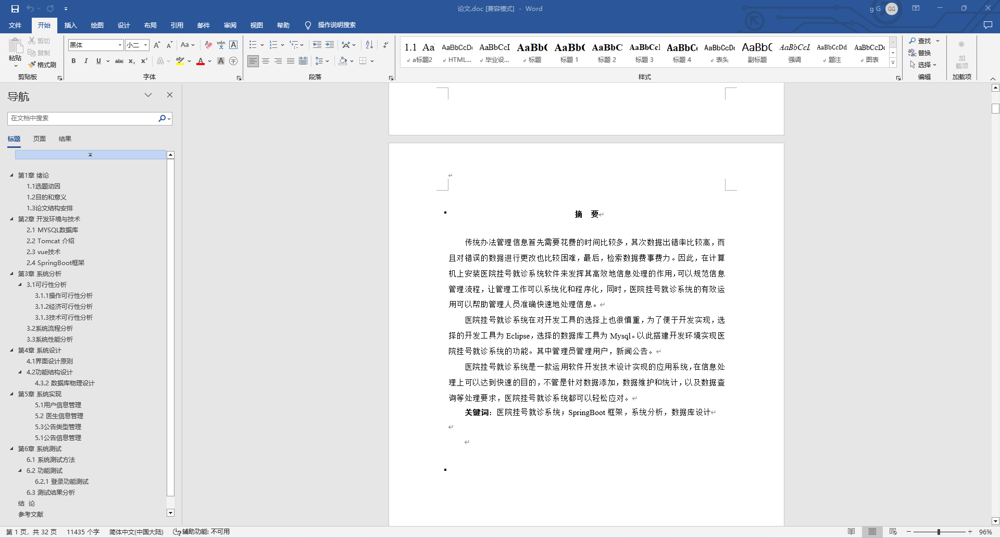
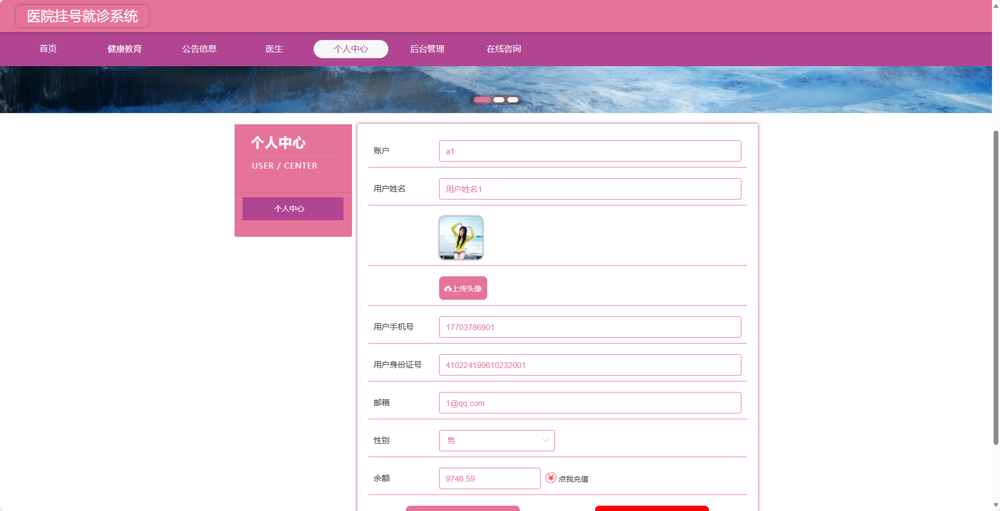
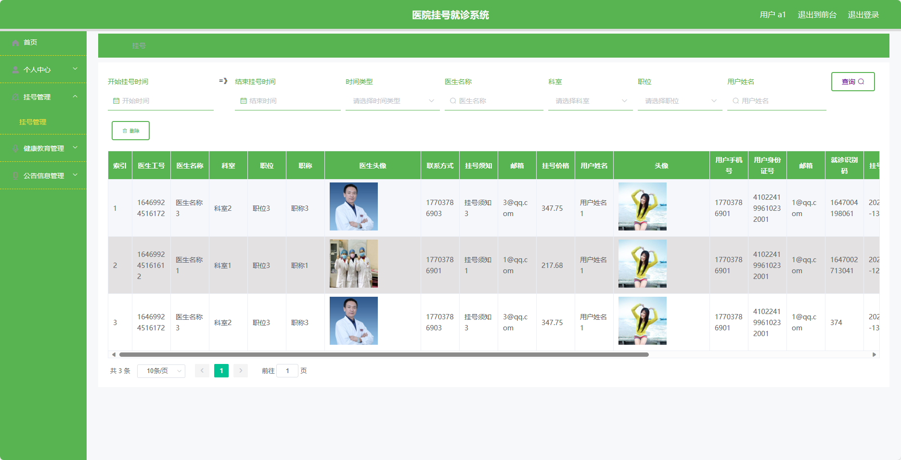
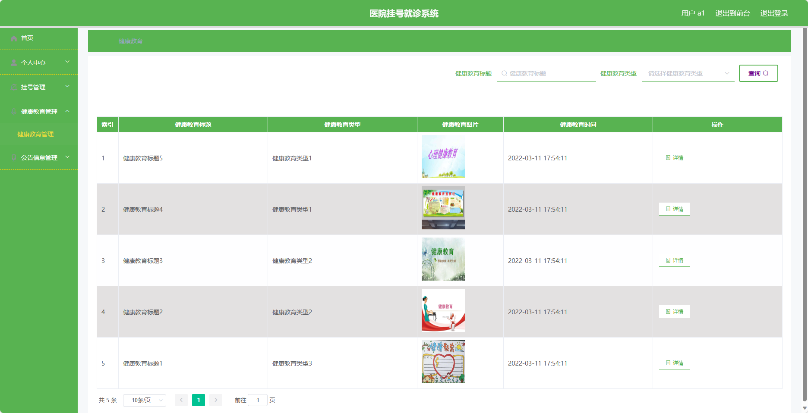
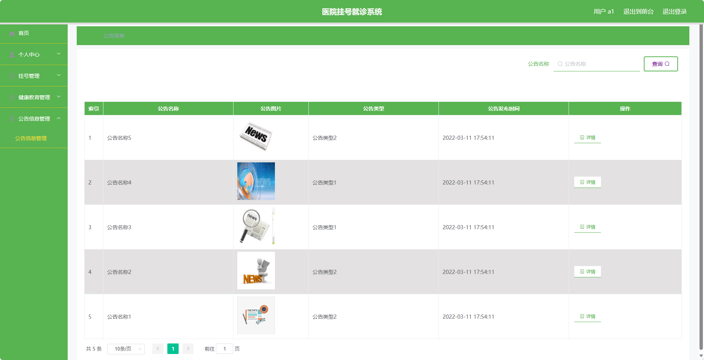
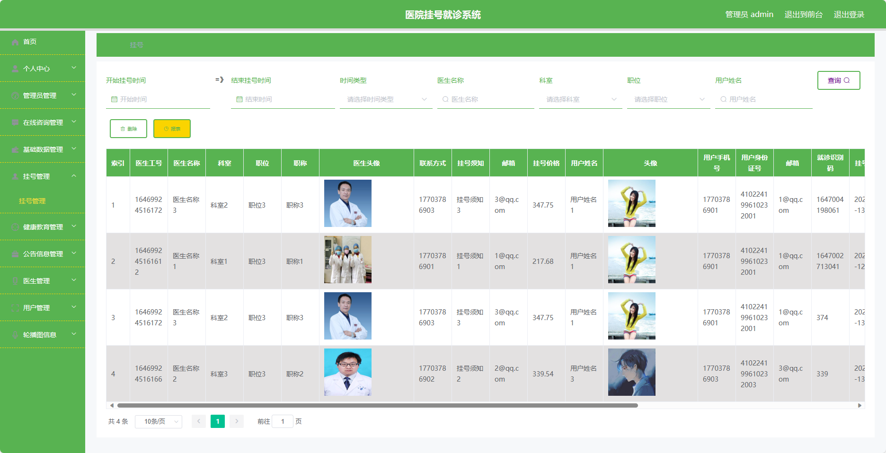

## 基于SpringBoot的医院挂号就诊系统(程序+报告)

- <b>完整代码获取地址：从戎源码网 ([https://armycodes.com/](https://armycodes.com/))</b>
- <b>技术探讨、资料分享，请加QQ群：692619798</b> 
- <b>作者微信：19941326836  QQ：952045282</b> 
- <b>承接计算机毕业设计、Java毕业设计、Python毕业设计、深度学习、机器学习</b>
- <b>选题+开题报告+任务书+程序定制+安装调试+论文+答辩ppt 一条龙服务</b>
- <b>所有选题地址 ([https://github.com/YuLin-Coder/AllProjectCatalog](https://github.com/YuLin-Coder/AllProjectCatalog)) </b>

## 项目介绍
基于SpringBoot的医院挂号就诊系统，系统包含三种角色：管理员、医生、用户,系统分为前台和后台两大模块，主要功能如下。

### 【管理员】:
- 个人中心：管理个人信息。
- 管理员管理：管理系统管理员的基本信息。
- 在线咨询管理：管理用户与医生的在线咨询信息。
- 基础数据管理：管理系统的基础数据信息。
- 挂号管理：管理用户的挂号信息。
- 健康教育管理：管理健康教育的相关内容。
- 公告信息管理：管理医院的公告信息。
- 医生管理：管理医院的医生信息。
- 用户管理：管理系统用户的基本信息。
- 轮播图信息：管理系统首页轮播图的信息。		

### 【用户】:
- 个人中心：管理个人信息。
- 挂号管理：预约挂号、查看就诊记录等功能。
- 健康教育管理：浏览、收藏健康教育内容。
- 公告信息管理：查看医院公告及最新动态。
- 医生管理：查看医生信息、预约咨询等功能。

### 【前台】:
- 首页：展示医院相关信息、推荐医生等内容。
- 健康教育：提供健康知识、文章等相关内容。
- 公告信息：展示医院的公告及最新动态。
- 医生信息：展示医院的医生信息。
- 个人中心：提供用户管理个人信息、就诊记录等的入口。
- 在线咨询：提供用户与医生进行在线咨询的平台。

## 项目技术
- 编程语言：Java
- 数据库：MySQL
- 项目管理工具：Maven
- 前端技术：HTML、CSS、JavaScript、Jquery、Vue
- 后端技术：Spring、SpringMVC、MyBatis

## 运行环境
- JDK版本：JDK1.8及以上
- 开发工具：IDEA、Ecplise、Myecplise都可以
- 数据库: MySQL5.7及以上
- Maven：maven3.0及以上
- Node：14.14.0及以上

## 运行截图

